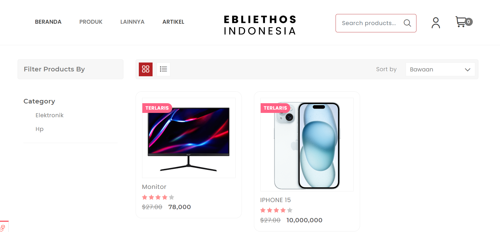

# Laravel 10 - Toko Online Ebliethos

## Screenshots



## Donwload

Clone Projek

```bash
  git clone https://github.com/JagatCorp/olshop-ebliethos.git nama_projek
```

Masuk ke folder dengan perintah

```bash
  cd nama_projek
```

-   Copy .env.example menjadi .env kemudia edit database dan api key nya

```bash
    composer update
```

```bash
    php artisan key:generate
```

```bash
    php artisan artisan migrate:fresh --seed
```

#### Login Admin

-   email = angga@gmail.com
-   password = 123
